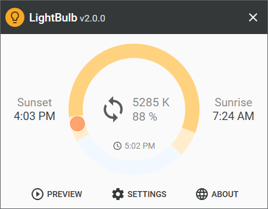
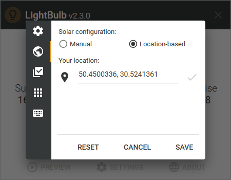

# LightBulb 💡

⚠️ **Project status: maintenance mode** (bug fixes only).

LightBulb is an application that reduces eyestrain produced by staring at a computer screen when working late hours.
As the day goes on, it continuously adjusts gamma, transitioning the display color temperature from cold blue in the afternoon to warm yellow during the night.
Its primary objective is to match the color of the screen to the light sources of your surrounding environment - sunlight during the day and artificial light during the night.
LightBulb has minimal impact on performance and offers many customization options.

❓ **If you have questions or issues, please refer to the [wiki](https://github.com/Tyrrrz/LightBulb/wiki)**.

💬 **If you want to chat, join my [Discord server](https://discord.gg/2SUWKFnHSm)**.

## Download

> Note that LightBulb only works on Windows 7 and higher.
Other operating systems are not supported.

- 🟢 [**Stable release**](https://github.com/Tyrrrz/LightBulb/releases)
- 🟠 [CI build](https://github.com/Tyrrrz/LightBulb/actions?query=workflow%3ACI)
- 📦 [WinGet](https://github.com/microsoft/winget-cli): `winget install Tyrrrz.LightBulb` (community-maintained)

## Features

- Extensive customization options
- Location-based sunrise and sunset times
- Manual sunrise and sunset times
- Whitelist for color-sensitive applications
- Global hotkeys for adjusting on the fly
- Smooth gamma transitions
- Minimal performance impact
- Works without internet connection

## Screenshots

