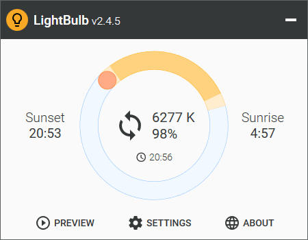
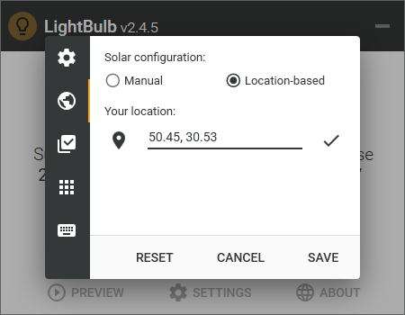

# LightBulb 💡

> 🟡 **Project status**: maintenance mode[[?]](https://github.com/Tyrrrz/.github/blob/master/docs/project-status.md)

**LightBulb** is an application that reduces eyestrain produced by staring at a computer screen when working late hours.
As the day goes on, it continuously adjusts gamma, transitioning the display color temperature from cold blue in the afternoon to warm yellow during the night.
Its primary objective is to match the color of the screen to the light sources of your surrounding environment — sunlight during the day and artificial light during the night.
**LightBulb** has minimal impact on performance and offers many customization options.

> ❔ If you have questions or issues, **please refer to the [wiki](https://github.com/Tyrrrz/LightBulb/wiki)**.

## Terms of use

By using this project or its source code, for any purpose and in any shape or form, you grant your **implicit agreement** to all the following statements:

- You **condemn Russia and its military aggression against Ukraine**
- You **recognize that Russia is an occupant that unlawfully invaded a sovereign state**
- You **support Ukraine's territorial integrity, including its claims over temporarily occupied territories of Crimea and Donbas**
- You **reject false narratives perpetuated by Russian state propaganda**

To learn more about the war and how you can help, [click here](https://tyrrrz.me). Glory to Ukraine! 🇺🇦

## Download

> ⚠️ **LightBulb** only works on Windows 7 and higher.
Other operating systems are not supported.

- 🟢 [**Stable release**](https://github.com/Tyrrrz/LightBulb/releases)
- 🟠 [CI build](https://github.com/Tyrrrz/LightBulb/actions/workflows/main.yml)
- 📦 [WinGet](https://github.com/microsoft/winget-cli): `winget install Tyrrrz.LightBulb` (community-maintained)

## Features

- Extensive customization options
- Location-based sunrise and sunset times
- Manual sunrise and sunset times
- Whitelist for color-sensitive applications
- Global hotkeys for adjusting on the fly
- Smooth gamma transitions
- Minimal performance impact
- Works without internet connection

## Screenshots

