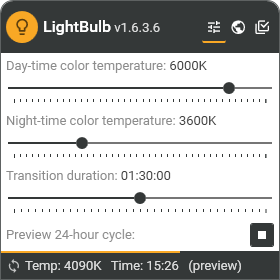
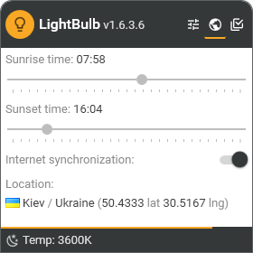
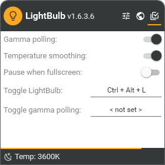

# LightBulb 💡

LightBulb is an application that reduces eyestrain produced by staring at a computer screen when working late hours. As the day goes on, it continuously adjusts gamma, transitioning the display color temperature from cold blue in the afternoon to warm yellow during the night. Its primary objective is to match the color of the screen to the light sources of your surrounding environment - typically, sunlight during the day and artificial light during the night. LightBulb has minimal impact on performance and offers many customization options.

_Currently only compatible with Windows 7 or higher._

## Screenshots

## Download

- **[Latest release](https://github.com/Tyrrrz/LightBulb/releases/latest)**
- [CI build](https://github.com/Tyrrrz/LightBulb/actions)

## Features

- Extensive customization options
- Pull sunrise and sunset times from the Internet or set them manually
- Smooth temperature transition for large changes
- Pause when a fullscreen application or game is in foreground
- Configurable global hotkeys
- Minimal impact on performance

## Libraries used

- [Stylet](https://github.com/canton7/Stylet)
- [PropertyChanged.Fody](https://github.com/Fody/PropertyChanged)
- [MaterialDesignInXamlToolkit](https://github.com/ButchersBoy/MaterialDesignInXamlToolkit)
- [Newtonsoft.Json](http://www.newtonsoft.com/json)
- [Hardcodet.NotifyIcon.Wpf](http://www.hardcodet.net/wpf-notifyicon)
- [Onova](https://github.com/Tyrrrz/Onova)
- [Tyrrrz.Extensions](https://github.com/Tyrrrz/Extensions)
- [Tyrrrz.Settings](https://github.com/Tyrrrz/Settings)